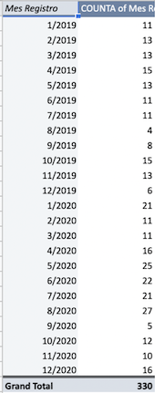
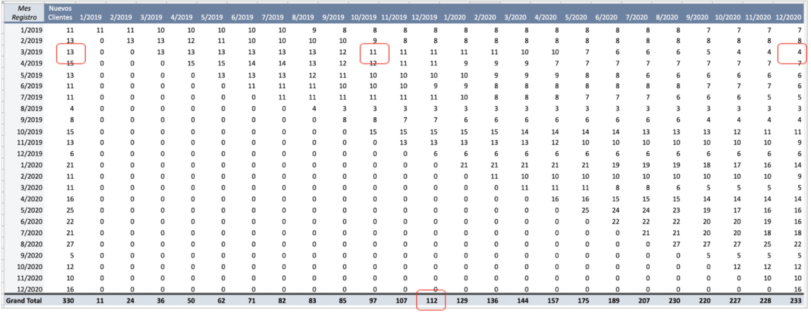
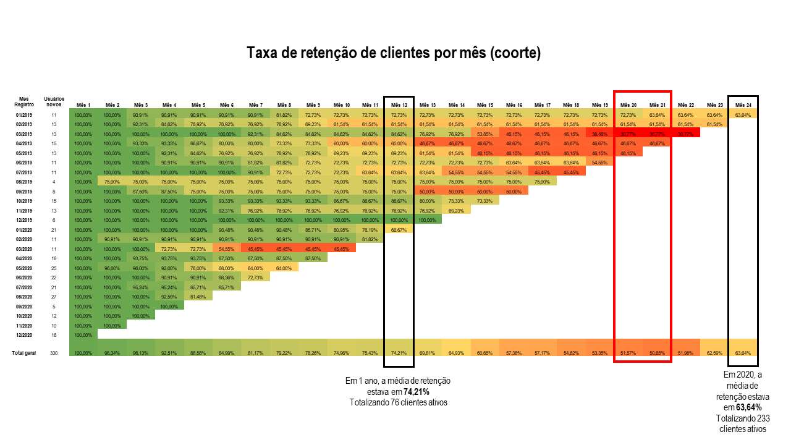
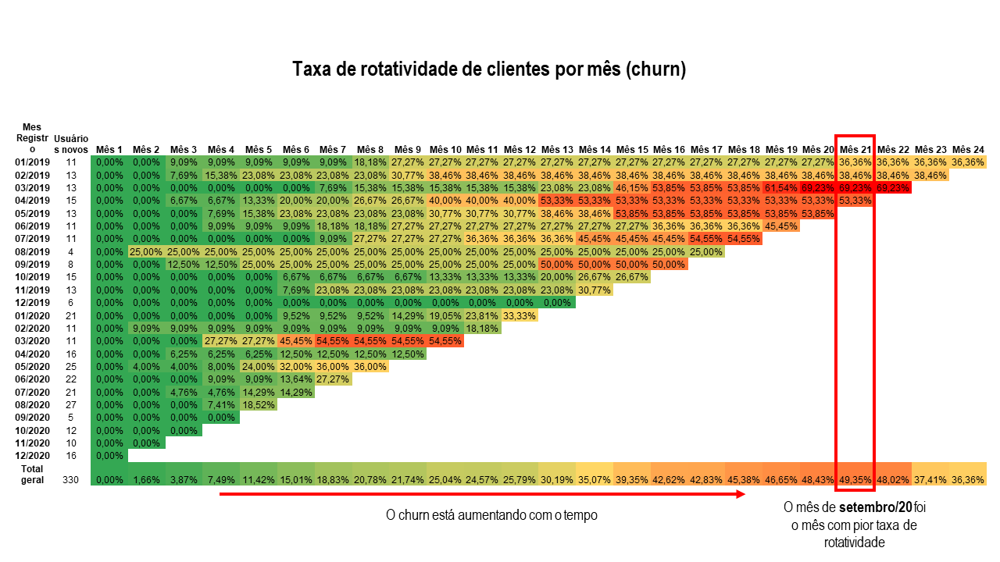
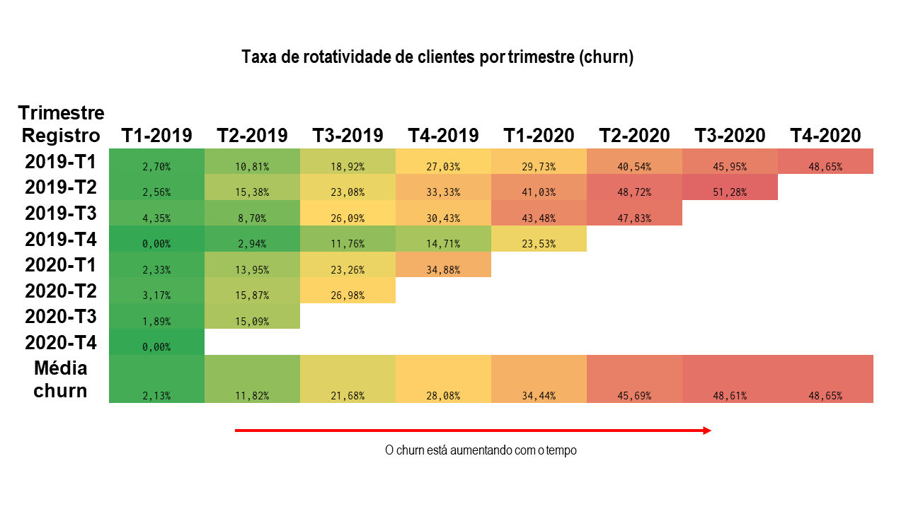
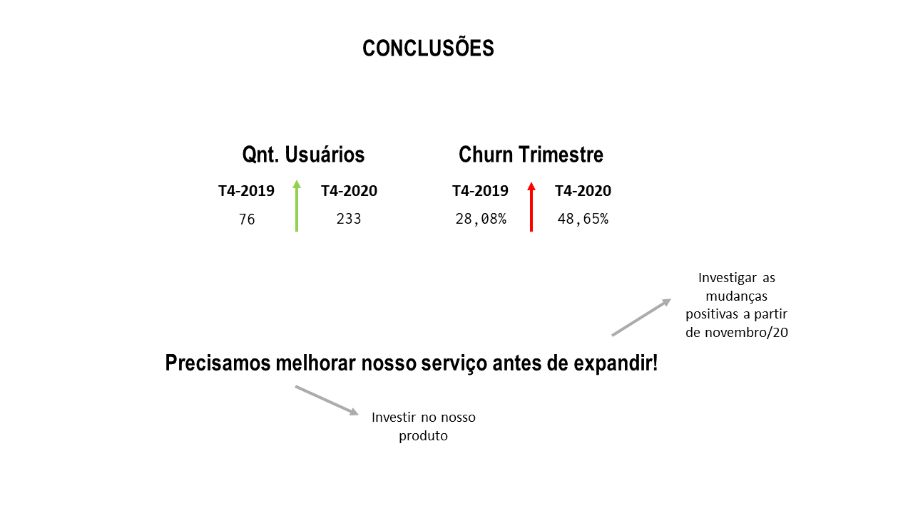

# Análise da Retenção de Startup Tecnológica
# Introdução
Esse foi o segundo projeto da Certificação de Análise de Dados da IBM/Laboratoria.
- Google Sheets, cohort, análise de churn, Product-Market-Fit. 
- Cursos importantes para conclusão do projeto: [Google Sheets - The Comprehensive Masterclass](https://www.udemy.com/certificate/UC-4c35090b-4cff-4731-9a93-1d3e29898c4d/)

## Briefing
Neste projeto, você realizará uma análise com base em um conjunto de dados sobre os clientes que usam um software de gestão de despesas na nuvem. Para responder às perguntas de negócios que surgirem, você precisará entender a estrutura dos dados, analisá-los e entender as métricas de negócios que permitirão comunicar suas descobertas e apoiar a tomada de decisões.

Para conclusão do projeto, as seguintes perguntas devem ser respondidas:
- Porcentagem de retenção de clientes por mês
- Porcentagem de retenção de clientes por trimestre
- O mês ou trimestre em que eles perderam mais clientes
- Porcentagem de rotatividade de clientes por mês
- Porcentagem de rotatividade de clientes por trimestre
- Você acha que deveria triplicar seu investimento em aquisição de usuários?
- Por que você considera isso? Mostre claramente seus resultados suportados por sua planilha ou uma apresentação.
- Quais recomendações você tem para a CEO?

## A situação
Você é um analista de dados júnior que trabalha para uma startup que oferece software de gestão de despesas na nuvem por meio de uma assinatura mensal. Mesmo estando na empresa há menos de um mês, sua chefe a convidou para a reunião de planejamento anual onde são definidas as prioridades para o ano e o orçamento.

A reunião começou moderada pela Diretora de Finanças, que apresentou um resumo das propostas de investimento para cada área. Os primeiros itens orçamentários foram revisados rapidamente por serem valores relativamente pequenos e por não apresentarem variação significativa em relação ao orçamento do ano anterior. No entanto, as coisas ficaram tensas na hora de revisar o orçamento de marketing. Artur, o Diretor de Marketing, propunha triplicar o investimento para aquisição de usuários em relação ao ano passado, argumentando que agora é a hora de expandir o negócio.
Artur se pronunciou:

>É hora de pisar no acelerador e escalar. Temos o dobro de usuários do ano passado, o que é uma boa massa crítica. É hora de investir no crescimento e expandir para novos mercados. Nosso produto é bom; eu mesmo entrevistei usuários que estão satisfeitos com o serviço. Temos Product-Market-Fit! Além disso, temos o capital porque acabamos de levantar a maior rodada de investimentos da nossa história. Não sei o que estamos esperando!

Para muitas pessoas presentes na reunião, o termo **Product-Market-Fit (PMF)** era novo. Eles tinham ouvido o termo, mas não necessariamente entendiam totalmente o que significava. Eles simplesmente sabiam que, como o nome indica, era uma forma de dizer que o produto "se encaixava" no mercado. Mas para Mercedes, diretora de User Experience Design (UX), ele não era novidade. Por isso, ela se atreveu a discutir com Artur:

>Artur, concordo com você que muitos de nossos usuários estão satisfeitos e que temos um bom produto em nossas mãos. Ao mesmo tempo, como já discutimos anteriormente, nosso produto ainda não possui muitas funcionalidades. Por exemplo, sabemos de usuários que cancelaram a inscrição e isso parece estar acontecendo com cada vez mais frequência. É verdade que dobramos o número de usuários, mas porque dobramos o investimento. Então, realmente não temos a certeza de que chegamos ao PMF. 

>Uma coisa que aprendi com o curso Como começar uma Startup de Sam Altman é que a retenção é uma das melhores métricas para determinar se o PMF foi alcançado. Isso é feito confirmando que uma boa base de usuários permanece usando o produto ao longo do tempo. Ou seja, se não conseguimos reter uma porcentagem saudável de usuários após 12, 18 ou 24 meses, significa que ainda não temos um produto comercializável, e todo o investimento de marketing é dinheiro que estamos jogando fora.

A essa altura, a CEO estava impaciente porque não era a primeira vez que essa discussão acontecia. Ela interrompeu a conversa: 

>Já discutimos isso antes e é por isso que é importante que tenhamos a análise de retenção de coorte* que solicitei na última reunião. De fato, a Mercedes está certa. Não tenho certeza se chegamos ao PMF e precisamos analisar os dados de retenção ao longo do tempo para determinar se é hora de escalar ou não. Até descobrirmos isso, não podemos dar luz verde ao plano de marketing. Talvez devêssemos antes alocar esse investimento para melhorar o produto. 

Com isso, ela se virou para olhar para seu chefe, o Gerente de Produto: 
>Preciso que tenhamos essa análise para a próxima reunião, para que possamos definir a estratégia da empresa para o ano, juntamente com o orçamento.

Ao sair da reunião, seu chefe pede que você aceite esse desafio porque pode ser uma boa experiência de aprendizado para você. 

Neste projeto, você precisará descobrir se o produto oferecido alcançou o Product-Market Fit através de uma análise de retenção de coorte mensal e trimestral dos clientes nos anos 2019 e 2020. 

**Cohort**: (coorte) é o termo técnico usado para um grupo de indivíduos que compartilham uma determinada característica adquirida ao mesmo tempo.

# Resolução
## 1. Importar e revisar o conjunto de dados
Importar o dataset no Google Sheets.

O conjunto de dados possui 330 linhas, sendo que cada linha representa um cliente único.

As colunas que armazena são:
- **Cliente**: Nome do cliente
- **Status do Cliente**: Pode ser "Ativo" (continua pagando a assinatura) ou "Churned" (não está mais pagando)
- **Mês de registro**: Mês em que começou a pagar a assinatura mensal
- **Mês de cancelamento**: Mês em que deixou de pagar a assinatura mensal
24 colunas, uma para cada mês do ano (de 1/2019 a 12/2020), que mostram se o cliente pagou (com o número 1) ou não (com uma célula vazia)

## 2. Entender a estrutura dos dados
Se você olhar atentamente para as primeiras linhas de seus dados, poderá começar a entender o que está acontecendo com cada cliente. Por exemplo:

O primeiro cliente é George García. Observamos que seu mês de registro é janeiro de 2019 (1/2019) e seu mês de cancelamento está em branco, o que significa que esse cliente está ativo e continua pagando a assinatura mensal. Isso pode ser confirmado porque todas as colunas relacionadas às datas de pagamento (de 1/2019 a 12/2020) se encontram preenchidas com o valor de 1, o que significa que ele tem pago a assinatura mensal por 24 meses seguidos.

O segundo cliente, James Johnson, também se inscreveu em janeiro de 2019, mas seu estado é churned (cancelamento), já que apenas as colunas 1/2019 e 2/2019 estão preenchidas, o que quer dizer que ele pagou somente dois meses de assinatura (janeiro e fevereiro), portanto seu mês de cancelamento seria março de 2019.

O último cliente da imagem, Daniel White, se inscreveu em fevereiro de 2019, mas conforme vemos no conjunto de dados só pagou por 4 meses (de 2/2019 a 5/2019), o que quer dizer que cancelou o serviço em maio do mesmo ano, portanto seu estado é churned.

Dos 3 clientes analisados, apenas um cliente continua pagando a assinatura mensal, ou seja, dos 3 clientes, retivemos apenas um e os outros dois cancelaram o serviço.

Agora, se queremos saber o número total de clientes que continuam pagando a assinatura ou deixaram de pagar, vamos agrupá-los por mês de registro.

## 3. Resumir o total de clientes por mês
Em nossa planilha do Google, precisamos replicar uma estrutura semelhante a uma análise de coorte, ou seja, agrupar os clientes de acordo com um critério. Para isso, vamos criar uma tabela dinâmica cujas linhas são as datas do mês de registro, e em cada linha o valor é o número de clientes que entraram naquela data

No resultado do agrupamento, podemos ver o número de clientes registrados por mês: 11 clientes se registraram no mês de janeiro de 2019 (1/2019), 13 clientes em fevereiro de 2019 (2/2019) e assim por diante, com um total de 330 clientes. 

## 4. Obter o número de clientes por mês
Em seguida, queremos adicionar colunas à tabela dinâmica para contar o número de clientes que ainda pagam pelo serviço em cada mês. Por exemplo, a primeira coluna que queremos acrescentar é 1/2019, pois gostaríamos de saber para cada linha quantos clientes pagaram naquele mês. A próxima coluna deve ser 2/2019 e assim por diante até completar 24 colunas (e chegar a 12/2020).
Em uma tabela dinâmica podemos adicionar colunas à medida que adicionamos mais valores.

⚠️ Neste caso, queremos que a tabela dinâmica totalize os valores dos clientes que atendem a esse critério. Portanto, resumimos as informações (summarize by) por SUM e não COUNTA como no caso da primeira coluna, onde queríamos contar o número de clientes em cada data.

Olhando os dados, podemos começar a compreendê-los com os seguintes exemplos:

- Na coluna “Novos Clientes”, há **13** clientes registrados em março de 2019 (3/2019)
- Desses **13** clientes (coorte março 2019), **11** continuam pagando em outubro 2019 (10/2019). E desses **13** clientes (coorte março 2019), apenas **4** continuaram pagando até dezembro de 2020 (12/2020)
- Nos totais na parte inferior, vemos que ao final de dezembro de 2019, tínhamos um total de 112 clientes pagantes.
- Você vai notar que, com o passar dos meses, o número de clientes diminui. Isto é muitas vezes inevitável, mas você quer que os números ao longo da linha horizontal diminuam o mais lentamente possível à medida que o tempo passa.

## 5. Organizar os dados
A fim de comparar os coortes, nos interessa conhecer o comportamento dos clientes ao longo dos meses desde que eles se inscreveram. Não nos interessa a data em particular. Em outras palavras, **nos interessa saber o que aconteceu com os clientes de cada coorte em um mês específico desde sua inscrição**. Por exemplo, se quiséssemos ver o que aconteceu com nossos clientes 5 meses após sua inscrição, tal mês seria diferente para cada coorte. Para o primeiro coorte (1/2019), o mês 5 corresponde a 5/2019, para o segundo (2/2019), 6/2019, para o terceiro (3/2019) seu quinto mês é 7/2019. Para a coorte na linha 10 (9/2019), seu 5º mês é 1/2020. Assim, cada coorte é "deslocada" um mês em relação à sua coorte anterior.

Se quisermos comparar 🍎 com 🍎 e 🍐 com 🍐, temos que alinhar o primeiro mês de cada coorte. Em termos gráficos, temos que partir da tabela atual:

Onde cada início de coorte segue seu mês de registro (podemos ver isso a partir dos nomes dos títulos das colunas), para uma tabela onde o início de cada coorte está na primeira coluna e os títulos não são as datas, mas o mês com o número correspondente. Algo assim:

### 5.1 Alinhamento dos dados
Para chegar na visualização ilustrada anteriormentes, precisamos mover cada linha para o iníco da tabela. A duas possibilidades para isso: usar uma fórmula que combina `PROCV`, `LINS` e `COLS` ou `QUERY`.

**Opção 1:** `=QUERY(INTERVALO_ONDE_ESTÃO_OS_DADOS,"SELECT * LIMIT 1")`

**Opção 2:** `=IFERROR(VLOOKUP($A2;qnt_novos_usuarios_mes!$A$1:$Z$25;ROWS(qnt_novos_usuarios_mes!$A$1:$A2)+COLUMNS(qnt_novos_usuarios_mes!$C$1:D2)-1;0);"")`

## 6. Calcular porcentagens e formatar
De qualquer forma, você conseguiu chegar a uma tabela que mostra quantos clientes estavam pagando em cada mês para cada coorte (ou data de inscrição).

Estamos agora prestes a extrair informações valiosas para compartilhá-las com seu chefe e a CEO para tomar decisões comerciais. Precisamos apenas replicar a mesma tabela (pode ser mais abaixo ou em outra aba), mas agora mostrando a porcentagem de acordo com o total de clientes inscritos para cada célula.

Para calcular a porcentagem de clientes retidos no mês 1, chamamos o número de clientes retidos naquele mês que se encontra na planilha anterior e o dividimos pela célula do número de clientes (Novos clientes na coorte 1/2019).

Para visualizar melhor a tabela e chegar mais rápido aos insights, inclua uma escala de cores. Selecione todo o intervalo de células com as porcentagens e vá para a opção Formatar -> Formatação condicional

Escolha “Escala de Cores” e selecione as cores vermelha, verde e amarela, bem como as porcentagens 0, 50 e 100 como mostrado na imagem.

### Análises
- É comum ver uma tendência (seta vertical) mostrando que as coortes mais jovens (por exemplo, 3/2020 ou 4/2020) estão melhores do que as coortes mais antigas (1/2019). Quanto mais jovem uma coorte, mais se espera que os clientes sejam retidos, porque isso significaria que o produto vem melhorando com o tempo e, portanto, os clientes estão voltando a consumi-lo. Este caso de negócio não está de acordo com isso.
- É normal notar que a porcentagem de clientes retidos está diminuindo com o passar do tempo (ver seta horizontal). A coorte 1/2019 começou com 100% e após 12 meses sua retenção é de 72,73%. A diminuição é inevitável, mas é desejável que as porcentagens ao longo da linha horizontal diminuam o mais lentamente possível.
- Exemplo de leitura das células: 69.23% de todos os clientes adquiridos em 11/2019 continuam pagando a assinatura 14 meses depois do registro. Você pode notar qual a coorte com maior retenção de clientes? Qual teve a pior retenção? A que isso pode ser devido?
- Vejamos os totais: 5 meses depois do registro, a média de clientes retidos era 88,58%
- O ponto mais crítico foi no mês 20 e 21, com 51%. 

# Resultado final

# Objetivos da aprendizagem
- **Organizar dados em planilhas**: conhecer os diferentes tipos de dados que uma célula aceita e conseguir formatar moedas, datas, números para melhor visualizar as informações. Além disso, usar filtros para organizar os dados e poder ordenar as colunas do maior para o menor (ou vice-versa) de acordo com o tipo de dados.
- **Manipular dados em planilhas**: usar tabelas dinâmicas para calcular, resumir e analisar dados para ver comparações, padrões e tendências neles. Além disso, poder conectar duas ou mais fontes de dados usando a função PROCV (VLOOKUP).
- **Selecionar e filtrar dados usando Queries**: usar a fórmula QUERY para selecionar todas ou um subconjunto de colunas de uma fonte de dados. Além disso, filtrar essas informações de acordo com as características de algumas de suas colunas.
- **Entender o conceito de Product Market Fit**: entender quando um produto ou serviço atingiu o PMF. Entender seu propósito e as repercussões de medir e monitorar essa métrica para o negócio. Conhecer as diferentes maneiras que existem para medi-lo.
- **Fazer uma análise por coorte**: organizar as informações para formar coortes de clientes de acordo com a data de entrada no produto/serviço. Realizar cálculos e formatar as informações para encontrar mapas de calor. Identificar pontos de fuga.
- **Tomar decisões de negócios com base em dados**: resumir e organizar os dados de forma a encontrar informações importantes para apoiar uma decisão de negócios. Entender os prós e os contras de tal decisão e operar dentro de uma certa margem de erro.

# Links
- [Instruções](https://www.kaggle.com/datasets/datacertlaboratoria/projeto-2-reteno-de-startup-tecnolgica)
- [Guia passo a passo](https://www.kaggle.com/code/datacertlaboratoria/guia-de-resolu-o-projeto-2)

