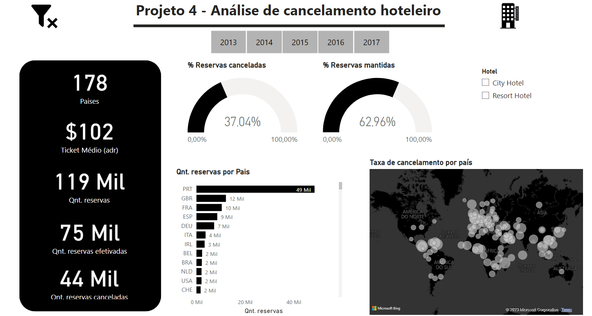
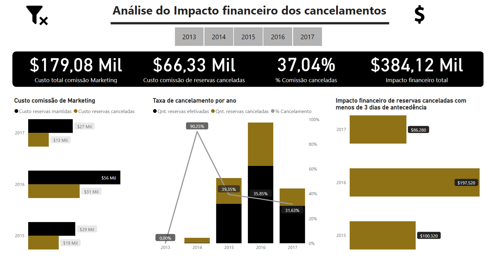
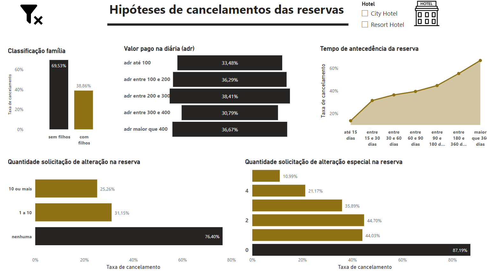

# Projeto 4: Análise de cancelamentos de hotéis
# Introdução
Esse foi o quarto projeto da Certificação de Análise de Dados da IBM/Laboratoria.

- PowerBI, Google Big Query
- Cursos importantes para conclusão do projeto: [Learn SQL for Data Analysis with Google Big Query](https://www.udemy.com/certificate/UC-56b080b2-e9a4-408f-913c-5a8cb8e3e975/) e [Power BI Completo - Do Básico ao Avançado](https://www.udemy.com/course/power-bi-completo-do-basico-ao-avancado/)


## Briefing
>Neste projeto você irá realizar uma análise de reservas em uma empresa hoteleira. Para o desenvolvimento deste projeto você colocará em prática o que aprendeu até agora e começará a utilizar duas ferramentas importantes para qualquer analista de dados. Uma delas é o BigQuery, um mecanismo de banco de dados criado pelo Google, que permite manipular dados de forma eficiente por meio da linguagem SQL. O segundo é o PowerBI, uma ferramenta de visualização de dados criada pela Microsoft.

**Entregável:**
- De quanto seria a economia anual estimada caso renegociassem o contrato com a agência para que o pagamento fosse por reserva materializada (não cancelada)? Explique como você chegou a esse número.
- O que você pode dizer sobre as hipóteses levantadas das reservas com maior probabilidade de serem canceladas? Que recomendações você tem com base em suas descobertas?
- Um dashboard em Power BI com todos os visuais/gráficos que você usou para argumentar suas conclusões no vídeo.


## A situação
Há alguns meses, Estela, sua chefe e mentora em seu antigo emprego, abordou você com uma notícia que mudou o rumo de sua carreira. Ela lhe disse que havia sido oferecido a ela uma vaga de CEO de uma empresa hoteleira muito importante no país e queria que você se juntasse à sua nova equipe desempenhando o papel de analista de dados. Foi um salto gigantesco para Estela, que na época trabalhava como gerente de produto, mas fez todo o sentido para você. Estela é uma craque no seu trabalho e se alguém poderia dar esse salto de gerente para CEO, era ela. Estela é, como dizem, uma Jedi Master, ou para quem prefere referências de Harry Potter, ela é o equivalente a Dumbledore. É por isso que você disse sim instantaneamente. Foi uma ótima oportunidade para continuar aprendendo com ela e, além disso, representou um salto importante em nível profissional para você também.

Já estavam na nova empresa há várias semanas tentando entender o negócio e fazendo uma introdução detalhada, quando descobriram algo interessante. Você, Estela e Daniel, gerente financeiro, estavam no Zoom no momento em que Estela comentou: “Estou analisando esse contrato que temos com a agência de marketing que nos ajuda a trazer potenciais clientes para o hotel, e estou vendo que **pagamos um pequeno custo fixo mensal pelo serviço, mas a maior parte é um custo variável vinculado às reservas**”. Daniel a interrompeu rapidamente: “Sim, isso é bom! Porque é assim que pagamos pelos resultados; ou seja, se eles nos trazem um cliente em potencial que não faz uma reserva, então não temos que pagar quase nada. Nós só pagamos quando esses clientes em potencial, esses leads, que eles nos trazem realmente fazem uma reserva no hotel. Eu mesmo negociei esse contrato!”

“Sim, eu entendo, Daniel”, respondeu Estela, fazendo um esforço para ser paciente, “**mas o que acontece se o cliente cancelar sua reserva?** Nesse caso estamos pagando por algo que não se concretiza em vendas, pois entendo que **os clientes só pagam quando chegam ao hotel, não quando fazem a reserva**. Sei que estou aqui há menos de 2 meses e ainda estou aprendendo, mas nesse tempo vi muitas reservas serem canceladas. **Qual é a taxa de cancelamento de reserva?** Eu não ficaria surpreso se 1 em cada 3 reservas for cancelada. Se assim for, estamos perdendo uma boa quantia de dinheiro por ano.” Daniel ficou atordoado. Ele simplesmente respondeu: “Sim, a verdade é que fizemos esse contrato há muitos anos, quando começamos, e naquela época os cancelamentos eram muito raros, então deixamos de fora do contrato. A verdade é que não verificamos se essa situação mudou”.

Estela olhou para você, mas antes que ela pudesse falar, você disse: “Sim, não se preocupe. Estou encarregada de fazer essa análise. Só preciso do banco de dados das reservas e saber o valor do custo variável que estamos pagando à agência”. "Obrigada" Estela respondeu com um sorriso. "Pelo que estou lendo, o contrato diz que **temos que pagar 1,5 USD por cada reserva feita**."

Sobre isso Daniel, que já havia voltado a si, mencionou: “Essa análise seria ótima. Com essas informações podemos renegociar o contrato com a agência. Aliás, outro fator importante em relação aos cancelamentos que venho dizendo há muito tempo é que nem todos os cancelamentos são iguais. Quando um cliente cancela no último minuto, incorremos em muitos outros custos adicionais. De acordo com as estimativas da equipe financeira, quando alguém cancela com menos de 3 dias de antecedência, nos custa cerca de 120 USD extra. Seria bom adicionar isso à análise. ”

“Bom ponto, Daniel”, disse Estela. “Além disso, se vamos analisar os cancelamentos, podemos também entender por que elas acontecem! Quais são as reservas com maior risco de cancelamento? Uma série de hipóteses me vem à mente.”

“A mim também!” Daniel e você responderam, quase ao mesmo tempo. Entre os três, eles concordaram que as principais hipóteses que guiarão essa parte da análise são as seguintes:

As reservas feitas com mais antecedência correm maior risco de cancelamento.
As reservas que incluem crianças têm menor risco.
Os usuários que fizeram alguma alteração em sua reserva têm menor risco.
Quando o usuário faz uma solicitação especial o risco é menor.
As reservas que possuem um “adr” baixo o risco é menor.

# Resolução
## 1. Importar os dados
Carregar o dataset no Google Big Query.

### 1.1 Explorar o set de dados com consultas SQL
- Escreva uma consulta que produza uma tabela com as colunas hotel, is_canceled, lead_time, arrival_date_year e apenas os 7 primeiros registros

```sql 
SELECT hotel, is_canceled, lead_time, arrival_date_year FROM projeto4-354301.cancelamentos_hotel.cancelamentos_reservas LIMIT 7
```

- Se estivermos interessados em saber quais valores a variável (coluna) hotel pode assumir, escrevemos:

```sql 
SELECT DISTINCT hotel FROM projeto4-354301.cancelamentos_hotel.cancelamentos_reservas
```

- Outra maneira útil de explorar dados é contando registros. Por exemplo, se quisermos contar quantas linhas todo o nosso conjunto de dados possui, podemos executar:

```sql
SELECT COUNT (*) FROM projeto4-354301.cancelamentos_hotel.cancelamentos_reservas
```

- Suponha que queremos apenas reservas feitas em um City Hotel. Use a função WHERE para obter esse resultado:

```sql
SELECT
  *
FROM
  projeto4-354301.cancelamentos_hotel.cancelamentos_reservas
WHERE
  hotel = 'City Hotel'
 ```

- Também podemos filtrar registros fazendo comparações com números. Tente selecionar apenas reservas que tenham sido feitas com menos de 3 meses de antecedência (menor ou igual a 90 dias de lead time).

```sql
SELECT
  *
FROM
  projeto4-354301.cancelamentos_hotel.cancelamentos_reservas
WHERE
  lead_time <= 90
```

- Se quisermos saber quantas reservas foram feitas em 2015, podemos aplicar um filtro com WHERE e depois contar esse resultado com COUNT. Algo como:

```sql
SELECT COUNT(*)
FROM
  projeto4-354301.cancelamentos_hotel.cancelamentos_reservas
WHERE
  arrival_date_year = 2015
```

- Você poderia nos dizer quantas reservas contêm pelo menos uma noite durante o fim de semana?

```sql
SELECT COUNT(*)
FROM
  projeto4-354301.cancelamentos_hotel.cancelamentos_reservas
WHERE
   stays_in_weekend_nights >= 1
```

- Suponha que queremos saber as reservas que foram feitas em Hotéis Resort e que não reservaram noites nos finais de semana (stays_in_weekend_nights zero).

```sql
SELECT
  *
FROM
  projeto4-354301.cancelamentos_hotel.cancelamentos_reservas
WHERE
  hotel = 'Resort Hotel'
  AND stays_in_weekend_nights = 0
 ```

- Quantas reservas foram feitas no mês de dezembro de 2016?

```sql
SELECT COUNT(*)
FROM
  projeto4-354301.cancelamentos_hotel.cancelamentos_reservas
WHERE
  arrival_date_year = 2016 AND arrival_date_month = 'December'
```

- Quais reservas canceladas (is_canceled=1) pertencem ao “market segment” TA?

```sql
SELECT *
FROM
  projeto4-354301.cancelamentos_hotel.cancelamentos_reservas
WHERE
is_canceled = 0 AND market_segment LIKE ('%TA%')
```

- CRIAR COLUNA COM DATA

```sql
CREATE TABLE
  cancelamentos_hotel.cancelamentos_reservas2 AS
SELECT
  *,
  CONCAT(arrival_date_year, '-',arrival_date_month, '-',arrival_date_day_of_month) AS arrival_date
FROM
  projeto4-354301.cancelamentos_hotel.cancelamentos_reservas
 ```

- Faça uma consulta que cria uma coluna com a sazonalidade (CASE IN, WHERE, ELSE)

```sql
CREATE TABLE projeto4-354301.cancelamentos_hotel.cancelamentos_reservas3 AS
SELECT

  *,
  CASE
    WHEN arrival_date_month IN ('January', 'February', 'March') THEN 'Verao'
    WHEN arrival_date_month IN ('April',
    'May',
    'June') THEN 'Outono'
    WHEN arrival_date_month IN ('July', 'August', 'September') THEN 'Inverno'
  ELSE
  'Primavera'
END
  AS arrival_season
FROM
  projeto4-354301.cancelamentos_hotel.cancelamentos_reservas2
```

- É uma boa prática procurar formas de encurtar a query

```sql
SELECT *,
CASE
    WHEN arrival_date_month IN ('January', 'February', 'March') THEN 'Verão'
    WHEN arrival_date_month IN ('April', 'May', 'June') THEN 'Outono'
    WHEN arrival_date_month IN ('July', 'August', 'September') THEN 'Inverno'
    ELSE 'Primavera'
    END AS arrival_season
FROM proyecto.dataset.tabla2;
```

- Criar uma nova variável "lead_time_segment" que segmenta a coluna "lead_time" em três segmentos: "Curto" (<30 dias), "Médio" ( entre 30 e 90 dias) e "Long" (mais de 90 dias).

```sql
SELECT
  *,
  CASE
    WHEN lead_time < 30 THEN 'CURTO'
    WHEN lead_time BETWEEN 30
  AND 90 THEN 'MÉDIO'
  ELSE
  'LONGO'
END
  AS lead_time_segment
FROM
  projeto4-354301.cancelamentos_hotel.cancelamentos_reservas3
 ```

- Criar uma coluna com o mês no formato correto

```sql
CREATE TABLE
  projeto4-354301.cancelamentos_hotel.cancelamentos_reservas4 AS
SELECT
  *,
  CASE
    WHEN arrival_date_month IN ('January') THEN '1'
    WHEN arrival_date_month IN ('February') THEN '2'
    WHEN arrival_date_month IN ('March') THEN '3'
    WHEN arrival_date_month IN ('April') THEN '4'
    WHEN arrival_date_month IN ('May') THEN '5'
    WHEN arrival_date_month IN ('June') THEN '6'
    WHEN arrival_date_month IN ('July') THEN '7'
    WHEN arrival_date_month IN ('August') THEN '8'
    WHEN arrival_date_month IN ('September') THEN '9'
    WHEN arrival_date_month IN ('October') THEN '10'
    WHEN arrival_date_month IN ('November') THEN '11'
  ELSE
  '12'
END
  AS arrival_number_month
FROM
  projeto4-354301.cancelamentos_hotel.cancelamentos_reservas3
 ```

- Concatenar a data 

```sql
CREATE TABLE
  projeto4-354301.cancelamentos_hotel.cancelamentos_reservas5 AS
SELECT
  *,
  CONCAT(arrival_date_year, '-',arrival_number_month, '-',arrival_date_day_of_month) AS arrival_date2
FROM
  projeto4-354301.cancelamentos_hotel.cancelamentos_reservas4
 ```

- Está em número e precisa ser DATA. Para alterar os tipos de dados no esquema, usamos a função CAST do BigQuery. Depois criar tabela.

```sql
SELECT
  *,
  CAST(arrival_date2 AS DATE) AS arrival_date_v2
FROM
  projeto4-354301.cancelamentos_hotel.cancelamentos_reservas5
```

- Criar coluna com a data de reserva

```sql
CREATE TABLE
  projeto4-354301.cancelamentos_hotel.cancelamentos_reservas7 AS
SELECT
  *,
  DATE_SUB(arrival_date_v2, INTERVAL lead_time DAY) AS booking_date
FROM
  projeto4-354301.cancelamentos_hotel.cancelamentos_reservas6
```

- Identificar quanto os clientes pagam em média por noite

```sql
SELECT
  AVG(adr)
FROM
  projeto4-354301.cancelamentos_hotel.cancelamentos_reservas7 
```

- Mostrar data mínima e máxima do conjunto de dados para a variável 'arrival_date_v2', assim como para a variável 'booking_date'. Desta forma, saberemos desde e até quando vão nossos dados históricos.

```sql
SELECT
  MIN(booking_date)
FROM
  projeto4-354301.cancelamentos_hotel.cancelamentos_reservas7
```

```sql
SELECT
  MAX(booking_date)
FROM
  projeto4-354301.cancelamentos_hotel.cancelamentos_reservas7 
```

- Suponha que queremos saber o adr médio para cada tipo de hotel. Como temos dois tipos ("Restor Hotel" e "City Hotel") poderíamos escrever duas consultas para saber seu valor:

```sql
SELECT AVG(adr)
FROM
  projeto4-354301.cancelamentos_hotel.cancelamentos_reservas7
WHERE hotel = 'City Hotel' 
```

- No entanto, o que aconteceria se, em vez de ter duas categorias de hotéis, essa rede tivesse 10? Então, teríamos que escrever 10 consultas para descobrir o valor médio de adr para cada uma dessas categorias. É aqui que a função GROUP BY se torna muito útil. Como o próprio nome indica, esta função agrupa os resultados de acordo com a coluna ou colunas que especificamos. Podemos reescrever as duas consultas anteriores em uma:

```sql
SELECT AVG(adr) AS valor_pago_por_noite
FROM
  projeto4-354301.cancelamentos_hotel.cancelamentos_reservas7
GROUP BY hotel
```

- O número de reservas existentes para cada segmento da variável lead_time_segment calculada anteriormente

```sql
SELECT lead_time_segment,
  COUNT(lead_time_segment) AS qnt_reservas
FROM
  projeto4-354301.cancelamentos_hotel.cancelamentos_reservas8
GROUP BY
  lead_time_segment
```  

- O número de reservas que temos para cada tipo de hotel durante os anos de 2015 e 2016 (aqui você deve usar WHERE além de GROUP BY)

```sql
SELECT hotel,
  COUNT(hotel) AS qnt_reservas
FROM
  projeto4-354301.cancelamentos_hotel.cancelamentos_reservas8
  WHERE arrival_date_year = 2015
  GROUP BY hotel
```

- O número de reservas que existe para cada ano e para cada tipo de hotel. Dica: Você pode usar mais de uma coluna no GROUP BY.

```sql
SELECT
  hotel,
  arrival_date_year,
  COUNT(hotel) AS qnt_reservas
FROM
  projeto4-354301.cancelamentos_hotel.cancelamentos_reservas8
GROUP BY
  hotel,
  arrival_date_year
 ```

- O número de reservas que existe para cada ano-mês e para cada tipo de hotel.

```sql
SELECT
  FORMAT_DATE("%Y-%m",arrival_date_v2) AS ano_mes,
  hotel,
  COUNT(hotel) AS qnt_reservas
FROM
  projeto4-354301.cancelamentos_hotel.cancelamentos_reservas8
GROUP BY
  1, 
  2
```
- O número de reservas que existe para cada ano-mês e para cada tipo de hotel, mas mostra apenas os meses-anos em que foram feitas mais de 3.500 reservas

```sql
SELECT
  arrival_date_v2 AS ano_mes,
  hotel,
  COUNT(hotel) AS qnt_reservas
FROM
  projeto4-354301.cancelamentos_hotel.cancelamentos_reservas8
GROUP BY
  1,
  2
ORDER BY
  1 ASC,
  2 DESC
```

## 2. Quantificar o impacto monetário de um cancelamento
- Quantidade de cancelamentos por ano

```sql
SELECT DISTINCT
  COUNT(CASE WHEN is_canceled = 1 THEN 1 END) AS qnt_reservas_canceladas,
  COUNT(CASE WHEN is_canceled = 0 THEN 1 END) AS qnt_reservas_mantidas,
  booking_date
FROM
  projeto4-354301.cancelamentos_hotel.cancelamentos_reservas8
GROUP BY
  booking_date
ORDER BY
  qnt_reservas_canceladas DESC
```

- Acrescentar coluna com custo

```sql
SELECT *, 
qnt_reservas_mantidas * 1.5 AS custo_reservas_mantidas,
qnt_reservas_canceladas * 1.5 AS custo_reservas_canceladas
 FROM projeto4-354301.cancelamentos_hotel.cancelamentos_reservas9
```

- Dias entre data do cancelamento e a data reservada: com quanta antecedência a pessoa cancelou? 

```sql
SELECT
  booking_date,
  DATE_DIFF(booking_date,reservation_status_date,day) AS days_between_cancelation_and_arrival
FROM
  projeto4-354301.cancelamentos_hotel.cancelamentos_reservas8
WHERE
  is_canceled = 1
GROUP BY
  1,
  2
ORDER BY
  booking_date
  ```
  
- Impacto de um cancelamento feito com menos de 3 dias de antecedência

```sql
SELECT
  booking_date,
  COUNT(days_between_cancelation_and_arrival) AS number_cancelattion_less_3_days,
  COUNT(days_between_cancelation_and_arrival) * 120 AS financial_impact
FROM (
  SELECT
    *,
    DATE_DIFF(arrival_date_v2,reservation_status_date,day) AS days_between_cancelation_and_arrival FROM `projeto4-354301.cancelamentos_hotel.cancelamentos_reservas8`
  WHERE
    is_canceled = 1)
WHERE
  days_between_cancelation_and_arrival < 3
GROUP BY
  booking_date
ORDER BY
  booking_date
```

## 3. Identifique as reservas com maior probabilidade de serem canceladas
- Hipótese 1: as reservas feitas com emergência tem maior possibilidade de ser cancelada

```sql
SELECT
*,
CASE
	WHEN lead_time between 0 and 15 THEN 'até 15 dias' 
	WHEN lead_time between 15 and 30 then 'entre 15 e 30 dias'
	WHEN lead_time between 30 and 60 THEN 'entre 30 e 60 dias'
	WHEN lead_time between 60 and 90 then 'entre 60 e 90 dias'
	WHEN lead_time between 90 and 180 then 'entre 90 e 180 dias'
	WHEN lead_time between 180 and 360 then 'entre 180 e 360 dias'
	WHEN lead_time > 360 then 'maior que 360 dias'
END AS categoria_lead_time
FROM
  `projeto4-354301.cancelamentos_hotel.cancelamentos_reservas8`
```

- Hipótese 2: As reservas que incluem crianças têm menor risco de cancelamento

```sql
SELECT
  AVG(is_canceled) AS taxa_cancelamento,
  categoria_filhos,
  hotel
FROM (
  SELECT
    *,
    CASE
      WHEN children = 0 THEN 'sem filhos'
      WHEN babies = 0 THEN 'sem filhos'
      WHEN children > 0 THEN 'com filhos'
      WHEN babies > 0 THEN 'com filhos'
  END
    AS categoria_filhos
  FROM
    `projeto4-354301.cancelamentos_hotel.cancelamentos_reservas8`)
GROUP BY
  2,
  3
```

- Hipótese 3: Os usuários que fizeram uma alteração em sua reserva têm menor risco de cancelamento

```sql
SELECT
  AVG(is_canceled) AS taxa_cancelamento,
  categoria_alteracoes,
  hotel
FROM (
  SELECT *,
    CASE
      WHEN booking_changes = 0 THEN 'sem alterações'
      WHEN booking_changes BETWEEN 1
    AND 10 THEN 'entre 1 e 10 alterações'
      WHEN booking_changes > 10 THEN '10 alterações ou mais'
  END AS categoria_alteracoes
  FROM
    `projeto4-354301.cancelamentos_hotel.cancelamentos_reservas8`)
GROUP BY
  2,
  3
```

- Hipótese 4: Quando o usuário fez uma solicitação especial, o risco de cancelamento é menor

```sql
SELECT
AVG(is_canceled) AS taxa_cancelamento,
total_of_special_requests,
hotel
FROM `projeto4-354301.cancelamentos_hotel.cancelamentos_reservas8`
GROUP BY
2,
3
```

- Hipótese 5: As reservas que possuem um baixo "adr" o risco é menor 

```sql
SELECT
  AVG(is_canceled) AS taxa_cancelamento,
  hotel,
  CASE 
  WHEN adr <100 THEN 'adr até 100'
  WHEN adr between 100 and 400 THEN 'adr entre 100 e 400'
  WHEN adr > 400 then 'adr maior que 400'
  END AS categoria_adr
  FROM `projeto4-354301.cancelamentos_hotel.cancelamentos_reservas8` 
  GROUP BY
  2,
  3
```

- Melhorando a hipótese
```sql
SELECT
  AVG(is_canceled) AS taxa_cancelamento,
  COUNT(is_canceled) AS qnt_reservas,
  COUNT(CASE WHEN is_canceled = 1 THEN 1 END) AS qnt_cancelados,
  categoria_adr
  FROM(SELECT *,
  CASE 
  WHEN adr <100 THEN 'adr até 100'
  WHEN adr between 100 and 200 THEN 'adr emtre 100 e 200'
  WHEN adr between 200 and 300 THEN 'adr entre 200 e 300'
  WHEN adr between 300 and 400 THEN 'adr entre 300 e 400'
  WHEN adr > 400 then 'adr maior que 400'
  END AS categoria_adr
  FROM `projeto4-354301.cancelamentos_hotel.cancelamentos_reservas8`)
  GROUP BY
  4
  ```

# Resultado final
- [Dashboard no PowerBI](https://app.powerbi.com/view?r=eyJrIjoiYTVhNTNkNmMtODA2My00YjNhLWFlZjgtZmVhMGU5ZTY4NjkyIiwidCI6IjM2ZWEwNTgxLThmMTMtNGI3ZC1hZDFhLTZjZDUxYzY2NTIzNyJ9&pageName=ReportSection69d34395470dd968ac82)







# Objetivos da aprendizagem
- *Organizar e manipular dados usando SQL*: entenda os principais comandos SQL (i.e. SELECT, FROM, WHERE, GROUP BY, ORDER BY, AVG, COUNT). Use a linguagem SQL para gerenciar as informações armazenadas no BigQuery. Limpe, filtre e resuma os dados de acordo com a necessidade do negócio.
- *Tomar decisões de negócios com base em dados*: resuma e organize os dados de forma a encontrar informações importantes para apoiar uma decisão de negócios. Entenda os prós e os contras de tal decisão e opere dentro de uma certa margem de erro.
- *Visualizar dados em uma ferramenta de Business Intelligence (BI)*: conheça o ambiente de desenho do PowerBI, mostre os principais indicadores e as estruturas em um dashboard que permite ao negócio obter conclusões acionáveis.
- *Organizar e comunicar as descobertas*: estruture sua análise em um relatório claro e organizado. Comunique efetivamente as conclusões a que chegou em seu projeto.

# Links
- [Instruções](https://www.kaggle.com/datasets/datacertlaboratoria/projeto-4)
- [Guia passo a passo](https://www.kaggle.com/code/datacertlaboratoria/guia-de-resolu-o-projeto-4)

